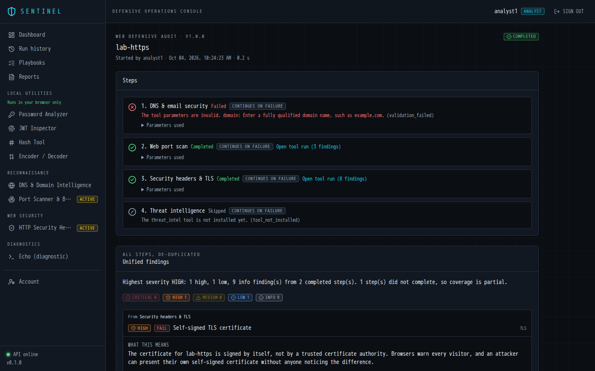
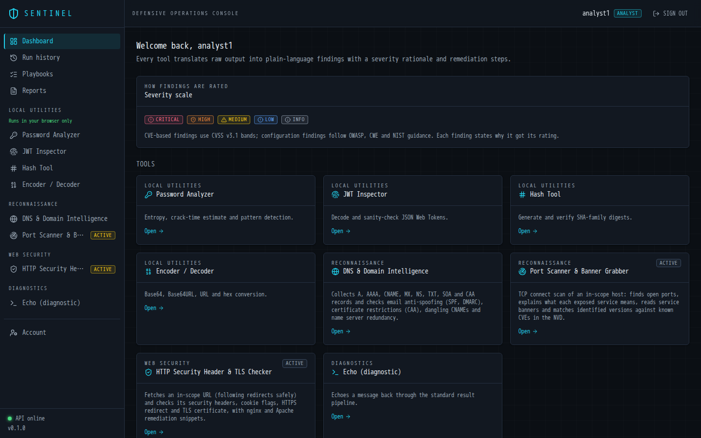
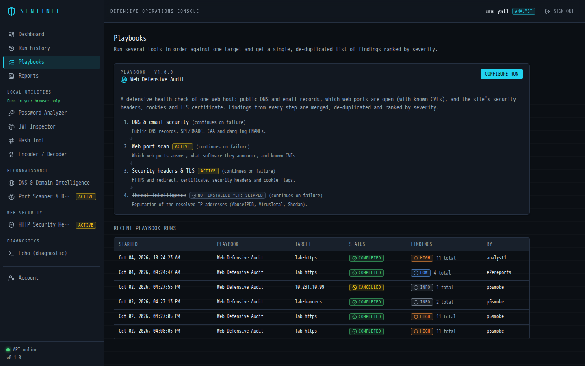
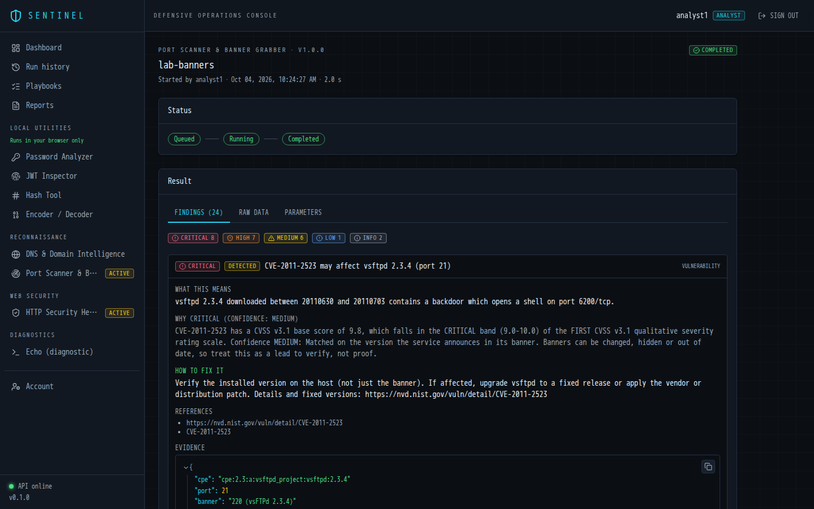
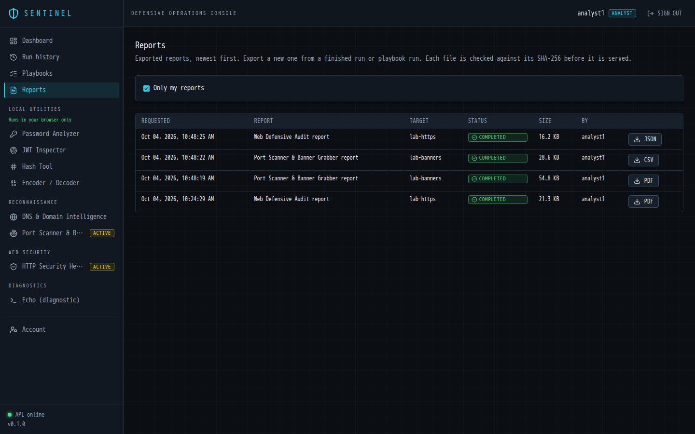
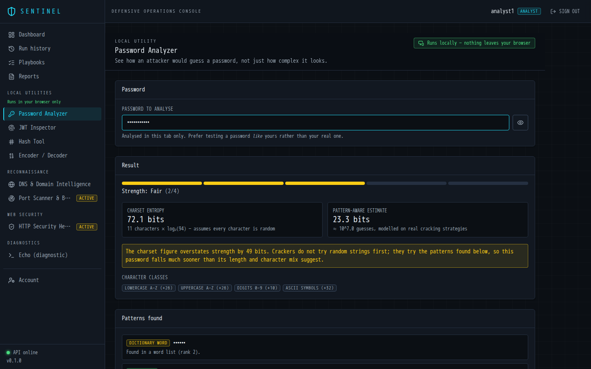
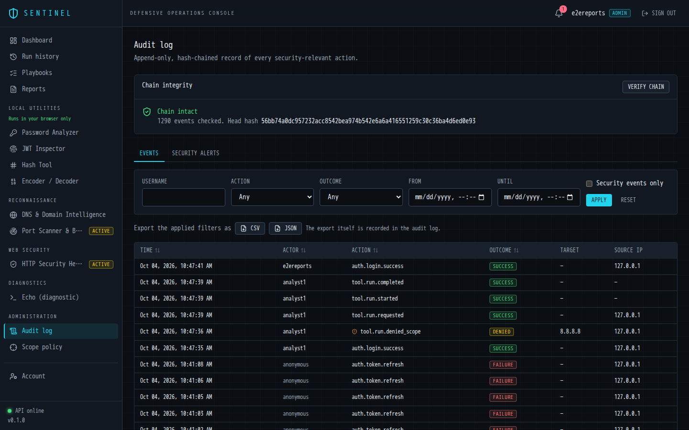
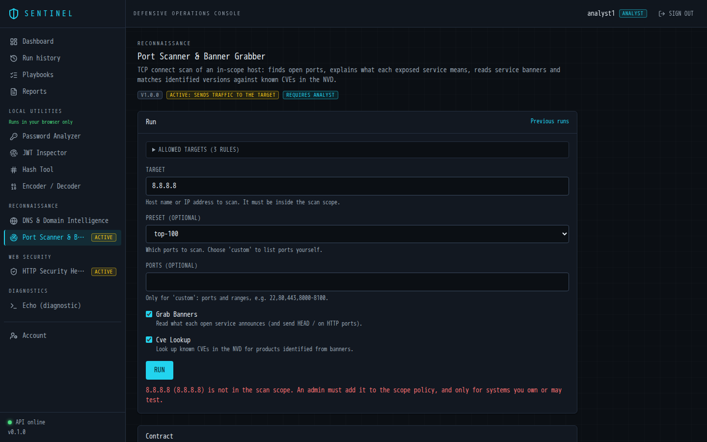
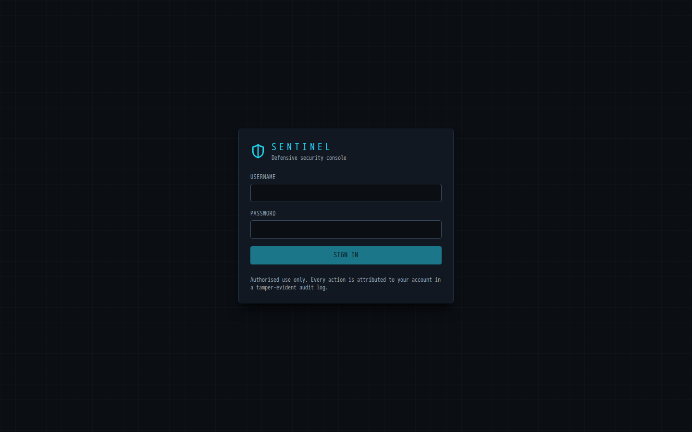
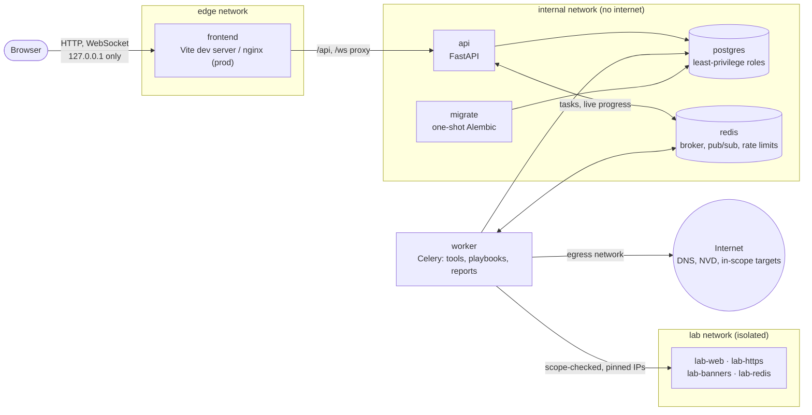

# Sentinel

**A defensive security platform that explains what it finds.**

Tools like Nmap and Wireshark produce raw data that takes an expert to read.
Sentinel runs defensive checks (DNS and email security, port and banner
scanning with CVE matching, HTTP security headers and TLS) and multi-step audit
playbooks, then turns the raw output into findings anyone can act on:

- **what was found**, in plain language;
- **how severe it is, and why**: every severity cites the standard it was decided by
  (CVSS v3.1 bands, OWASP, CWE, NIST);
- **how to fix it**, often with a ready-to-paste config snippet;
- **the evidence and raw data**, for advanced users;
- **a report**: PDF, CSV, JSON or plain text.

It also ships browser-only utilities (password analyzer, JWT inspector, hash
tool, encoder/decoder) that never send their input anywhere.

> **Ethics and authorised use.** Sentinel is for defence and education. Its
> active tools (port scanner, header and TLS checker) send traffic to the
> target, so they only run against targets an administrator has put in scope,
> after the user has accepted an authorised-use statement, and every run is
> attributed to a named user in a tamper-evident audit log. Only scan systems
> you own or have written permission to test. Sentinel contains no exploitation
> or offensive capability, and it is not a replacement for professional tooling
> or a penetration test.



**Status:** capstone core complete (Phases 0–8, 12–14). Log analysis, file
integrity monitoring and network diagnostics (Phases 9–11) are planned. See [`docs/PROGRESS.md`](docs/PROGRESS.md).

---

## Contents

1. [Demo in 10 minutes](#demo-in-10-minutes)
2. [What you can do](#what-you-can-do)
3. [Screenshots](#screenshots)
4. [Architecture](#architecture)
5. [Security design](#security-design)
6. [Production profile](#production-profile)
7. [Development and testing](#development-and-testing)
8. [Troubleshooting](#troubleshooting)
9. [Documentation](#documentation)

---

## Demo in 10 minutes

You need **Docker Desktop** (or Docker Engine with Compose v2.24+), Git, and
**Python 3.10+** to run the launcher. The launcher uses the standard library only,
so there is nothing to `pip install`. The first build downloads images and
dependencies, which takes 3–6 minutes on a typical connection.

**1. Clone and start** with one command:

```bash
git clone https://github.com/Anshuman-Singh-14/sentinel.git
cd sentinel
python run.py            # on macOS/Linux this may be `python3 run.py`
```

`run.py` does everything:
1. Checks Docker is installed and running, and that Compose is v2.24 or newer.
2. Creates `.env` with random secrets. It never overwrites an existing `.env`
   and never prints the secrets.
3. Builds and starts the stack with the lab targets, then waits until the API is
   healthy.
4. If there is no administrator yet, asks for a username. The password goes
   into the backend CLI's own prompt, so it never appears on a command line.
5. Opens http://localhost:5173.

The stack includes database migrations, the API, the worker, the web app, and
four deliberately simple **lab targets** on an isolated network: an nginx site,
an HTTPS site with a self-signed certificate, a fake-banner server that pretends
to run outdated FTP/SSH/SMTP/MySQL, and an open Redis.

| Command | What it does |
|---|---|
| `python run.py` | Start (or restart) the dev stack with the lab targets |
| `python run.py --no-lab` | Start without the lab targets |
| `python run.py --prod` | Production profile on http://localhost:8080 ([details](#production-profile)) |
| `python run.py --logs` | Follow the logs (Ctrl+C to quit) |
| `python run.py --stop` | Stop everything; data is kept |
| `python run.py --reset` | Stop and **delete all data** (asks for confirmation) |

Why the launcher may start processes when the rest of Sentinel never does:
[ADR 0013](docs/adr/0013-host-launcher-subprocess-exception.md).

<details>
<summary><strong>Manual setup (fallback, without the launcher)</strong></summary>

1. Create `.env` with random secrets: `sh scripts/init-env.sh` (macOS, Linux,
   WSL, Git Bash), or `powershell -ExecutionPolicy Bypass -File scripts\init-env.ps1`
   on Windows. By hand: copy `.env.example` to `.env` and replace each
   `CHANGE_ME` with a long random hex string.
2. Start everything, including the lab targets:
   `docker compose --profile lab up --build -d --wait`
3. Create the first administrator (there is no default account):
   `docker compose exec api python -m app.cli create-admin --username admin`
4. To stop: `docker compose --profile lab down`. Add `-v` to delete the data as well.

</details>

**2. Sign in at http://localhost:5173.** Then:

| Step | Where | What you will see |
|---|---|---|
| 1 | **Playbooks → Web Defensive Audit** | Accept the authorised-use statement (once). Target: `lab-https`; Website URL: `http://lab-https:8080/`. Start |
| 2 | The playbook run page | Steps go live over a WebSocket: DNS, web port scan, headers and TLS. The DNS step fails with a clear reason (`lab-https` is not a public domain), and the audit continues |
| 3 | **Unified findings** | De-duplicated findings from every step, led by the HIGH self-signed certificate, each with explanation, severity rationale and fix |
| 4 | **Reports → Export as PDF** | A report generated by the worker, with cover page, executive summary and severity chart. Download it |
| 5 | **Port Scanner & Banner Grabber** | Target `lab-banners`, preset `custom`, ports `21,22,23,25,3306`. Banners, CPE fingerprints and CVE matches with honest confidence levels |
| 6 | **Local tools → Password analyzer** | Runs entirely in your browser; the badge says so and the tests prove it |
| 7 | **Log File Analyzer** | File on the server: `auth.log` (a bundled sample). Password guessing, user enumeration, a login after failures and root logins, each with first/last time, source IP and a fix. Try `nginx_access.log`, or upload your own log |
| 8 | **Admin → Audit log** | Every action above, hash-chained. Press **Verify chain**, and export to CSV |

**Optional: threat intelligence.** Add free API keys to `.env` (`ABUSEIPDB_API_KEY`,
`VIRUSTOTAL_API_KEY`, `SHODAN_API_KEY`; links in `.env.example`) and run
`python run.py` again. The tool page then lists which providers are on.
Look up a public address or domain, and the Web Defensive Audit's last step
checks the target's resolved IPs. Without keys the tool shows *Not configured*
and the playbook skips that step.

Also try a target that is **not** in scope, such as `8.8.8.8` in the port
scanner. It is refused before any packet is sent, and the refusal is a
security event in the audit log.

To stop: `python run.py --stop`. To delete the data as well: `python run.py --reset`.

## What you can do

| Area | Capability |
|---|---|
| **DNS & email security** | A/AAAA/MX/NS/TXT/CAA, SPF, DMARC, dangling CNAMEs, name-server redundancy, private-IP exposure. Uses explicit public resolvers, never Docker's internal DNS |
| **Port scanner** | TCP connect scan with bounded concurrency, presets or custom lists, passive banners, CPE fingerprinting, NVD CVE matching (cached and rate-limited) with CVSS-based severity |
| **Threat intelligence** | IP, domain and file-hash reputation from AbuseIPDB, VirusTotal and Shodan (each enabled by its API key): concurrent and cached lookups within per-provider budgets, partial results when a provider fails, and the source named on every finding. Private addresses are never sent to third parties |
| **Log analyzer** | SSH auth.log and nginx/Apache access logs, uploaded (streamed, size-capped, deleted after the run) or read from a read-only server directory through a path guard. YAML detection rules for password guessing, user enumeration, logins after failures, root logins, path traversal (including encoded variants), scanners, request floods and error spikes |
| **Header & TLS checker** | HTTPS and redirects, certificate validity, chain, name and expiry, TLS 1.0/1.1 support, HSTS, CSP weakness analysis, clickjacking, cookie flags. Includes nginx and Apache snippets |
| **Playbooks** | YAML-defined multi-step audits with safe step references, stop/continue on failure, optional steps, cancellation, and unified de-duplicated findings |
| **Reports** | PDF, CSV, JSON and TXT from any finished run or playbook, generated by the worker, SHA-256-verified on download, audited |
| **Local tools** | Password analyzer (zxcvbn), JWT inspector with local signature verification, hash tool, encoder/decoder. All 100% in-browser |
| **Identity & audit** | Users and roles (viewer, analyst, admin), sessions, a hash-chained append-only audit log, security alerts, audit export |
| **Scope policy** | Admin-managed allowed CIDRs and domains, a hard denylist of Sentinel's own infrastructure, and the authorised-use acknowledgement |

## Screenshots

| | |
|---|---|
|  **Dashboard** |  **Playbook catalogue** |
|  **Port scan findings with CVE matches** |  **Report history** |
|  **Local-only password analyzer** |  **Hash-chained audit log, chain verified** |
|  **Out-of-scope target refused before any traffic** |  **Sign-in (no default account)** |

## Architecture



**How a run flows:**

1. The browser posts `/api/v1/tools/{tool}/runs`.
2. The API authenticates the user, checks the role and CSRF token, validates the
   parameters against the tool's schema, checks authorisation and scope, and
   writes the run row and its audit event in one transaction. Only then does it
   queue a Celery task, which carries the run id and nothing else.
3. The worker claims the run with a compare-and-set, re-checks scope
   authoritatively after DNS resolution, and runs the tool against the pinned
   addresses.
4. While the tool runs, the worker publishes progress to Redis, and the API
   relays it to the browser over a WebSocket.
5. The tool's **translator** turns raw output into the standard `ToolResult`
   with educational findings. The findings are stored and the run is audited.

Every tool is a self-contained module registered with the tool registry. Adding
one does not require changing core code. Details:
[`docs/spec/01-architecture.md`](docs/spec/01-architecture.md) and the ADRs.

| Layer | Technology |
|---|---|
| Frontend | React 19, TypeScript 6, Vite, Tailwind 4, TanStack Query, React Router |
| API | Python 3.12, FastAPI, Pydantic v2, SQLAlchemy 2 (async), Alembic |
| Workers | Celery 5 on Redis 7.4 (JSON serialisation only) |
| Data | PostgreSQL 16 |
| Reports | ReportLab (PDF), stdlib csv and json |
| Quality | pytest (≈700 tests), vitest (≈335), ruff, mypy (strict), bandit, pip-audit, eslint, prettier, gitleaks, GitHub Actions |

## Security design

Sentinel is itself a security tool, so it is held to the standard it checks
for. The full STRIDE threat model, with 74 numbered threats and their
mitigations, is in [`docs/threat-model.md`](docs/threat-model.md). Highlights:

- **No shell, ever.** Tools use `socket`, `asyncio`, `dnspython`, `httpx` and
  `ssl`. A static test and bandit fail the build on `subprocess`, `eval`,
  `exec`, `pickle` and unsafe YAML. Celery accepts JSON only.
- **Scope before traffic.** Active tools run only against admin-approved CIDRs
  or domains, after DNS resolution. Sentinel's own subnets, cloud metadata and
  link-local ranges are permanently denied. The checked addresses are pinned,
  which defeats DNS rebinding. Redirects are re-validated hop by hop (SSRF
  guard).
- **Identity and sessions.** Passwords are hashed with Argon2id.
  - Sessions use opaque tokens in `__Host-` cookies with rotating refresh
    tokens; reuse of a refresh token revokes the session.
  - CSRF tokens are bound to the session, and Origin is checked.
  - Repeated failed logins lock the account with exponential backoff, and logins
    are rate-limited per IP. Responses never reveal whether a username exists.
  - Roles are viewer, analyst and admin, and `tests/security/test_authz_matrix.py`
    checks every route against every role.
- **Tamper-evident audit.** Every security-relevant action is recorded with
  who, what, target, outcome and request ID.
  - Each row is SHA-256-chained to the previous one, and the app's database
    role cannot UPDATE or DELETE audit rows (a trigger enforces it).
  - The whole chain can be verified on demand.
  - Logs and audit details pass through a redaction processor first.
- **Least privilege everywhere.**
  - The app connects as a role with no DDL rights; migrations run as a separate
    owner role in a one-shot container.
  - Containers run as non-root, with all capabilities dropped and
    `no-new-privileges`. In production their root filesystems are read-only.
  - Postgres and Redis are on a network with no internet access, and no ports
    are published beyond 127.0.0.1.
- **Hostile output handled safely.** Tool output is rendered as escaped text
  (never `dangerouslySetInnerHTML`), PDFs escape all markup, CSV exports are
  formula-injection safe, and downloads use server-built ASCII filenames.
- **Sentinel passes its own header checker.** The production front end and API
  are scanned with the built-in checker in CI (`scripts/self_header_check.py`),
  with zero findings above INFO.
- **Client-side tools are provably local.** A static import-graph test and a
  runtime test with every network API trapped prove the password, JWT, hash and
  encoding tools never send data anywhere.

Design decisions and the reasons for them are recorded in
[`docs/adr/`](docs/adr) (ADR 0001–0014).

## Production profile

The default stack is for development: hot reload, source mounted into
containers, API on its own port. The production profile is an override file:

```bash
python run.py --prod
```

Or by hand:

```bash
docker compose -f docker-compose.yml -f docker-compose.prod.yml up --build -d --wait
docker compose -f docker-compose.yml -f docker-compose.prod.yml exec api \
    python -m app.cli create-admin --username admin
```

Then open **http://localhost:8080**. The differences are:

- **Images:** backend containers use the slim `runtime` image (code baked in, no
  dev tools, no reload), and the web app is a static build served by
  unprivileged nginx.
- **One entry point:** nginx proxies `/api` and `/ws` to the API and is the only
  published port.
- **Hardening:**
  - Root filesystems are read-only.
  - `ENVIRONMENT=production`: JSON logs, no `/docs`, HSTS on API responses, and
    insecure cookie settings refused at startup.
  - The API trusts `X-Forwarded-For` only from nginx's pinned address, so audit
    records show the real client IP.

For a real deployment, put TLS in front of nginx and set `PROD_ORIGIN` to the
public `https://` origin. Production secrets belong in Docker secrets or your
platform's secret store rather than a `.env` file. Rationale: ADR 0011.

## Development and testing

```bash
docker compose up --build                                   # dev stack (http://localhost:5173)
docker compose run --rm api pytest                          # backend unit tests
docker compose --profile test run --rm test                 # backend unit + integration (real Postgres/Redis)
docker compose run --rm api sh -c "ruff check . && mypy app tests alembic && bandit -r app -ll -c pyproject.toml"
docker compose exec frontend npm run test                   # frontend tests
docker compose exec frontend npm run lint
docker compose run --rm migrate alembic revision --autogenerate -m "msg"   # new migration
```

Checks against a running stack, executed inside the api container so nothing is
installed on the host:

```bash
# Load test: N users starting runs concurrently through the real quotas and workers.
LOADTEST_ADMIN=admin LOADTEST_PASSWORD='...' \
  docker compose exec -T -e LOADTEST_ADMIN -e LOADTEST_PASSWORD api python - < scripts/load_test.py

# Sentinel's header checker against its own production front end.
docker compose -f docker-compose.yml -f docker-compose.prod.yml exec -T api \
  python - < scripts/self_header_check.py
```

Load-test results (8 users × 30 runs on Docker Desktop, production profile):
240/240 runs completed and 126 requests were refused by the per-user quota and
retried, as designed. Creating a run took 36 ms at p50 and 62 ms at p95, with no
5xx responses, and the audit chain verified across 1,221 events.

CI (`.github/workflows/ci.yml`) runs the backend and frontend gates, a secret
scan, a development-stack smoke test with integration tests, and a
production-profile smoke test that includes the self header check.

## Troubleshooting

| Problem | Fix |
|---|---|
| `Bind for 127.0.0.1:5173 failed: port is already allocated` | Change `FRONTEND_PORT` (or `API_PORT`, `PROD_PORT`) in `.env` |
| `Pool overlaps with other one on this address space` | Another Docker network uses `10.231.x.x`. Change the `SENTINEL_*_SUBNET` (and `SENTINEL_*_IP`) values in `.env` |
| Hot reload does not pick up changes (Windows/macOS) | Keep `VITE_USE_POLLING=true` and `WATCHFILES_FORCE_POLLING=true` (the defaults) |
| Integration tests skip or fail on an older volume | Create the test database once: `docker compose exec postgres sh /docker-entrypoint-initdb.d/02-test-db.sh` |
| Frontend dependency changed | `docker compose exec frontend npm ci` (the `node_modules` volume is not refreshed by a rebuild) |
| The DNS tool times out | Your network blocks public DNS. Set `DNS_NAMESERVERS=` (empty) in `.env` to use the system resolver |
| Login works but nothing else does in Safari on `http://localhost` | Safari does not send `Secure` cookies over HTTP. Use another browser, or set `COOKIE_SECURE=false` for development only |
| Slow file watching or locked files | Keep the checkout outside OneDrive or Dropbox folders |

## Documentation

- [`CLAUDE.md`](CLAUDE.md): engineering rules for the project
- [`docs/spec/`](docs/spec): architecture, modules, logging and audit, security, phases
- [`docs/adr/`](docs/adr): architecture decision records (0001–0012)
- [`docs/threat-model.md`](docs/threat-model.md): STRIDE threat model
- [`docs/PROGRESS.md`](docs/PROGRESS.md): phase-by-phase progress and acceptance evidence
- [`CHANGELOG.md`](CHANGELOG.md): release history

## License

MIT. See [LICENSE](LICENSE).
